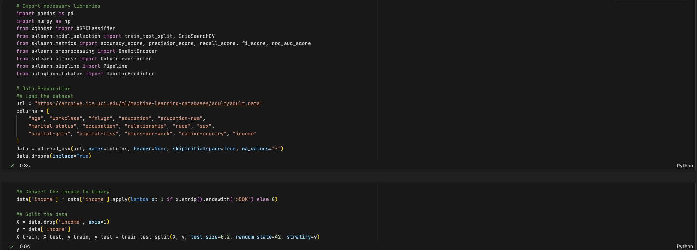
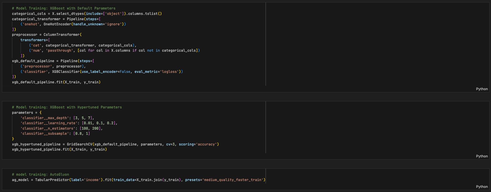
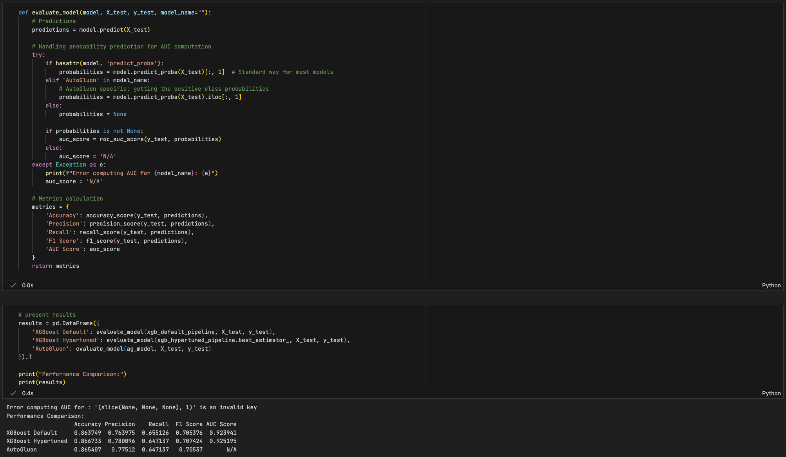

# Team AutoGluon or Off?
As machine learning technology becomes increasingly essential across various industries, there is a growing demand for tools that simplify the development and deployment of ML models. AutoGluon claims to offer a user-friendly platform that requires minimal coding and ML domain knowledge, making it potentially ideal for non-technical users.

This research project aims to evaluate the suitability of AutoGluon, an automated machine learning (AutoML) framework, for non-technical or semi-technical workers seeking to incorporate machine learning (ML) into their professional activities. The study will compare AutoGluon's usability, accessibility, and performance against other well-known ML algorithms such as CatBoost and XGBoost.

The project will specifically assess whether AutoGluon can enable non-technical users to effectively and efficiently apply ML to solve real-world problems, comparing it to the more traditional, yet popular, ML frameworks like CatBoost and XGBoost. The comparison will focus on key metrics such as ease of use, learning curve, model accuracy, and the overall time required from data input to actionable outputs.

By providing clear, empirical data on how well AutoGluon and other algorithms meet the needs of non-technical users, this research will guide organizations and individuals in selecting the most appropriate ML tools for their needs, potentially democratizing the use of machine learning technology.

